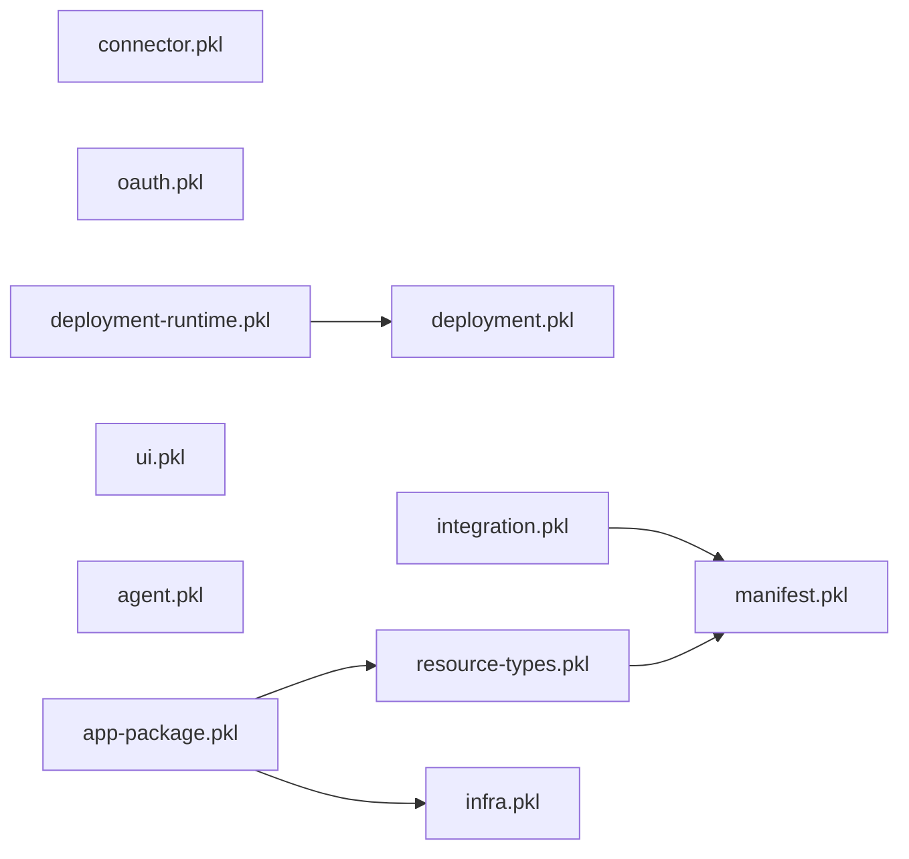

# Tangram App Manifest Module Refactor Plan

## Status

Implementation in progress for `tangram-app-manifest@2.0.0`. The package
module split, reproducible contract fixtures, loader annotation discovery, and
CLI templates are implemented locally; external consumers still need to move
to the published package.

This plan deliberately does not preserve source compatibility with
`@tangram-app-manifest/core.pkl`. Consumers will migrate to explicit,
domain-owned modules. Manifest JSON remains stable unless a separately approved
schema change is called out.

## Context

`core.pkl` currently mixes several independent domains:

- Foundational manifest identities and app types
- Resource types, actions, IAM, and mappings
- Integration interfaces
- Connector request authentication
- Deployment-time telemetry collection
- Helm deployment metadata
- A UI routing type

Dedicated modules already exist for OAuth, UI components, agents,
infrastructure, deployment authoring, and built-app packages. Keeping the
remaining vocabulary in one catch-all module makes ownership unclear and causes
unrelated changes to converge on the same file.

The goal is a dependency graph in which every module has one clear domain,
schema-only modules are safe to evaluate in any context, and consumers import
only the vocabulary they use.

## Decisions

1. Remove `core.pkl`; do not retain a compatibility facade.
2. Publish the result as `tangram-app-manifest@2.0.0`.
3. Move classes rather than copying them. Duplicate PKL classes are distinct
   types and are not interchangeable.
4. Preserve serialized field names, defaults, constraints, and discriminators
   unless a coordinated runtime schema change is explicitly included.
5. Separate deployment schema from deployment-time property reads.
6. Keep OAuth in `oauth.pkl`; it owns connection lifecycle rather than generic
   HTTP authentication.
7. Put current metrics and tracing collection declarations in `deployment.pkl`.
   Extract a broader `telemetry.pkl` only if non-deployment observability policy
   is introduced later.

## Target module structure

```text
src/
  manifest.pkl
  resource-types.pkl
  integration.pkl
  connector.pkl
  oauth.pkl
  deployment.pkl
  deployment-runtime.pkl
  ui.pkl
  agent.pkl
  infra.pkl
  app-package.pkl
```



Arrows point from an importing module to its dependency. `manifest.pkl` and
`deployment.pkl` are schema-only and must not perform environment or external
property reads.

## Module ownership

### `manifest.pkl`

Dependency-free foundational declarations:

- `MANIFEST_SPEC_VERSION`
- `TANGRAM_OS_GROUP_NAME`
- `AppName`
- `ResourceType`
- `TANGRAM_OS_CORE_APP`
- `NATIVE_APP_TYPE`
- `CONNECTOR_APP_TYPE`
- `AGENT_APP_TYPE`
- `AppType`
- `ConfigField`

`ConfigField` belongs here because `settings.pkl` and `secrets.pkl` are shared
by native apps, connectors, and infrastructure-oriented applications.

### `resource-types.pkl`

Imports `manifest.pkl` and owns the resource, action, and IAM vocabulary:

- Privilege constants
- Effect constants
- `ResourceNameExtractor` and all variants
- `OpenApiMapping`
- `SqlColumnType`
- `SqlActionParam`
- `SqlMapping`
- `HandlerMapping`
- `ResourcePrivilegeRequirement`
- `ActionPresentation`
- `Action`
- `Role`
- `ResourceTypeVersion`
- `ResourceTypeDefinition`
- Platform resource constants such as `WORKSPACE_TYPE`, `DATASET_TYPE`, and
  `DASHBOARD_TYPE`

This is expected to remain the largest module. The declarations form one
cohesive resource-governance contract and should not be split further unless
the action-mapping subsystem grows substantially.

### `integration.pkl`

Imports `manifest.pkl` and owns integration contracts:

- `AppIntegrationInterface`
- `IntegrationImplementation`
- `TANGRAM_SQL_APP`
- `DATA_CATALOG_APP`
- `SPARK_IO`
- `SQL_QUERYABLE`
- `SCHEMA_UPDATOR`
- `TangramSQLQueryableSpec`

### `connector.pkl`

Owns generic connector request authentication:

- `HeaderTemplate`, renamed from `Template`
- `ConnectorAuth`

OAuth declarations do not move here. Generic request authentication describes
how a proxied request is shaped; OAuth describes how an upstream connection is
created, refreshed, scoped, and revoked.

### `oauth.pkl`

Retains the OAuth authorization-code and connection-lifecycle vocabulary.

`Either` is renamed to `SelectableScope` while retaining `kind = "Either"`.
This improves the authoring API without changing the serialized discriminator
or requiring a Scala decoder change.

### `deployment.pkl`

Becomes a pure deployment schema module containing:

- `CloudProvider`
- `DeploymentContext`
- Custom component metadata and specification classes
- `MetricsCollection`
- `OtlpMetrics`
- `PrometheusMetrics`
- `ComponentObservability`
- `ContainerMeta`
- `HelmComponent`
- `CustomResourceRbac`
- `HelmChart`

Consolidate the existing `AppContainerMeta` and `ContainerMeta` declarations
into the single `ContainerMeta` class because they have the same shape.

`AppComponentMeta` remains an annotation and `HelmComponent` remains a plain
data class; their different evaluation roles do not justify forcing them into
one inheritance hierarchy.

### `deployment-runtime.pkl`

Imports `deployment.pkl` and owns all evaluation-time behavior:

- The module-level `context` value
- `read("prop:...")` calls
- Deployment configuration parsing
- CPU and memory formatting helpers
- Replica and container configuration accessors

Moving property reads here makes `deployment.pkl` safe for registration-time
evaluation of Helm and component metadata.

### `ui.pkl`

Retains the existing UI component vocabulary and gains `UriPattern`.

Consider renaming `UriPattern` to `ProxyUriPattern` only if the corresponding
runtime decoder and all UI manifests are updated in the same breaking release.

### Existing specialized modules

- `agent.pkl` remains independent because its current declarations do not use
  foundational manifest or resource types.
- `app-package.pkl` imports `resource-types.pkl` and `infra.pkl` directly.
- `infra.pkl` remains independent.

Internal package modules must use direct domain imports. They must not recreate
an umbrella dependency through another module.

## Canonical consumer imports

A connector with governed resource actions and OAuth would use:

```pkl
import "@tangram-app-manifest/manifest.pkl" as manifest
import "@tangram-app-manifest/resource-types.pkl" as resources
import "@tangram-app-manifest/connector.pkl" as connector
import "@tangram-app-manifest/oauth.pkl" as oauthTypes
```

A Helm deployment manifest would use:

```pkl
import "@tangram-app-manifest/deployment.pkl" as deployment
```

A custom component manifest that also needs injected runtime context would use:

```pkl
import "@tangram-app-manifest/deployment.pkl" as deployment
import "@tangram-app-manifest/deployment-runtime.pkl" as deploymentRuntime
```

No canonical example should import `core.pkl` after the migration.

## Migration scope

The migration inventory must cover more than the Google, Microsoft, and Notion
connector repositories. Existing `core.pkl` consumers include native apps and
connectors using resource definitions, settings, secrets, deployment metadata,
and UI routing.

At minimum, search all maintained repositories for:

```text
@tangram-app-manifest/core.pkl
core.ConfigField
tangram.ConfigField
core.ResourceTypeDefinition
tangram.ResourceTypeDefinition
core.ComponentObservability
tangram.HelmChart
tangram.UriPattern
```

Known families include Airflow, Snowflake, Databricks, ClickHouse, RisingWave,
QuickBooks, Spark, Iceberg, Flyduck, Google, Microsoft, and Notion. The final
inventory should be generated from source rather than maintained manually.

## Implementation phases

### Phase 1: Establish contract fixtures

Before moving declarations:

1. Add representative fixtures for each domain.
2. Render their JSON with the current package.
3. Store canonical snapshots or a comparison script.
4. Include defaults, null handling, constraints, and every discriminator.

The checked-in `examples/contract-fixture/fixture.pkl` is the source of
`expected.json` and renders with `omitNullProperties = false`. Gradle's
`verifyContractFixture` compares the current render with that snapshot. Run
`updateContractFixtureSnapshot` only when intentionally accepting contract
drift, including a major-version break.

Fixtures should cover:

- Resource actions using OpenAPI, SQL, and handler mappings
- Roles and resource-type inheritance
- Integration implementations
- Settings and secrets
- Generic connector headers
- OAuth defaults and all scope/tenant variants
- Custom component deployment
- Helm deployment with observability and CRD RBAC
- UI routing and UI components
- Agent and built-app package manifests

### Phase 2: Create the new modules

1. Create `manifest.pkl` first.
2. Move resource and integration declarations to modules that import
   `manifest.pkl`.
3. Move connector authentication declarations.
4. Convert `deployment.pkl` into a schema-only module.
5. Move runtime property reads and helpers to `deployment-runtime.pkl`.
6. Move `UriPattern` to `ui.pkl`.
7. Delete `core.pkl` after internal imports compile.

Never leave duplicate class definitions during an intermediate commit. Move a
class and update every typed reference in the same logical change.

### Phase 3: Update Tangram runtime and tooling

Update:

- Tangram CLI manifest templates and generators
- Manifest authoring documentation and skills
- Test resources under the Tangram repository
- `AppManifestLoader` schema-reflection matches for
  `ai.tangram.os.deployment#AppComponentSpec` and
  `ai.tangram.os.deployment#AppComponentMeta`
- Scala comments that identify the PKL source module
- Scala decoders if any class discriminator is renamed

The loader should continue decoding the same rendered JSON. PKL module paths
are normally an authoring concern and should not become runtime JSON fields.
The exception is annotation/schema reflection: Pkl exposes the defining
module's qualified class name, so discovery code must migrate those identities
with the schema module.

### Phase 4: Migrate external consumers

For every maintained app repository:

1. Replace `core.pkl` with the required domain imports.
2. Update qualified constructor and constant references.
3. Update its `PklProject` dependency to `2.0.0`.
4. Regenerate `PklProject.deps.json` through `pkl project resolve`.
5. Evaluate every `.pkl` module using the published package.
6. Run Tangram manifest validation for the complete app package.

Consumer migrations and the `2.0.0` package release must be coordinated. A
consumer should not merge a `2.0.0` import before that package is available.

### Phase 5: Publish and verify

1. Build the package with JDK 21 and the repository Gradle tasks.
2. Verify every expected module exists in the generated archive.
3. Publish `tangram-app-manifest@2.0.0`.
4. Resolve the published package from a clean PKL cache or environment.
5. Validate the complete consumer matrix against the published checksum.

## Validation requirements

The refactor is complete only when all of the following hold:

- `core.pkl` no longer exists.
- No maintained consumer imports `core.pkl`.
- The package contains every target module.
- No class is defined in more than one module.
- All internal module imports are acyclic.
- Every fixture evaluates successfully.
- Pre- and post-refactor JSON is identical except for explicitly approved
  breaking schema changes.
- Tangram discovers `AppComponentMeta` under the deployment module's qualified
  name and recovers component variable names.
- A loader regression test covers the consolidated `ContainerMeta` inside the
  `AppComponentMeta` annotation, including nullable descriptions and
  observability metadata.
- Tangram Scala decoders accept all rendered fixtures.
- Every maintained external app passes PKL and Tangram manifest validation.
- All dependency lockfiles resolve the same published `2.0.0` checksum.

## Risks and controls

### Missed consumers

The largest risk is undercounting `core.pkl` consumers. Generate the inventory
with repository-wide search and track each migration explicitly.

### Circular imports

Domain modules must depend on `manifest.pkl`, never on `core.pkl` or one
another indirectly. Run an import-graph check in CI.

### PKL type-identity failures

Moving a class preserves identity only when there is one canonical definition.
Do not copy declarations as a migration bridge.

### Runtime property reads during schema evaluation

Keep every `read("prop:...")` call in `deployment-runtime.pkl`. Add an evaluator
that imports and renders deployment schema without supplying runtime
properties.

### Silent JSON drift

Compare normalized JSON for representative consumers before and after the
move. Pay particular attention to defaulted properties and discriminated
unions. Render with null properties included so null-versus-absent drift is
visible.

The rendered fixture does not contain Pkl annotations, so it cannot prove the
`AppComponentMeta`/`ContainerMeta` consolidation by itself. Keep that coverage
in the Tangram schema-reflection loader test.

## Versioning decision

This is a source-breaking package reorganization and must use a major version.
The intended release is `tangram-app-manifest@2.0.0`.

Tangram CLI previously scaffolded a dependency on `2.3.0`, but no such package
was published; that value was a stale forward pin rather than an existing API
version. The CLI now deliberately targets `2.0.0`, the first release containing
the domain modules emitted by its templates. There is therefore no published
`2.3.0` contract to preserve or conflict with this release number.

The Google, Microsoft, and Notion dependency updates to `1.1.3` should be
treated separately. If this refactor begins immediately, decide whether to
commit those updates as a short-lived stabilization step or move those
consumers directly to `2.0.0` once it is published.

## Definition of done

The module refactor is done when `core.pkl` has been removed, every maintained
consumer uses explicit domain imports, the generated JSON contract has been
verified, the Tangram runtime accepts the migrated manifests, and all consumer
lockfiles resolve the published `2.0.0` package.
